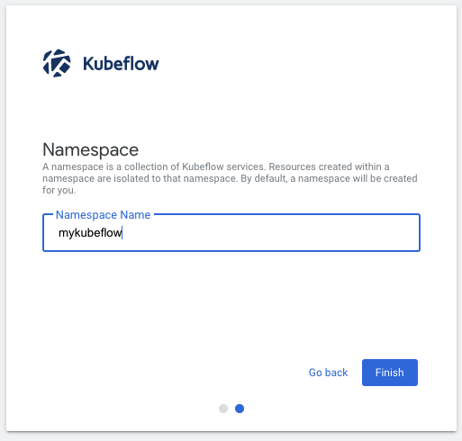
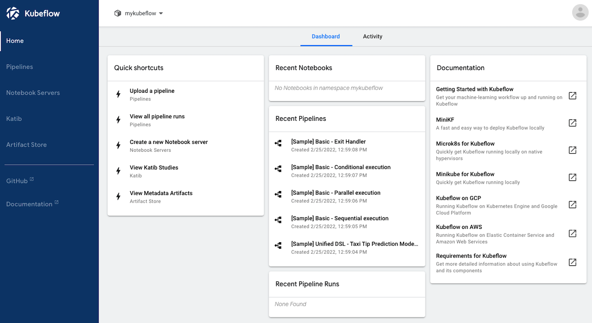

# Kubeflow
[Kubeflow](https://www.kubeflow.org/) provides a simple, portable, and scalable way of running Machine Learning workloads on Kubernetes.

## Download example
Download this example on your workspace
```sh
git clone https://github.com/Young-ook/terraform-aws-eks
cd terraform-aws-eks/examples/kubeflow
```
## Prerequisites
This module requires *yq* which is a lightweight command-line YAML, JSON, and XML processor. We will use *yq* to update the settings in the kubeflow configuration file. To install *yq*, follow the [installation guide](https://github.com/mikefarah/yq#install) before you begin. And if you don't have the terraform and kubernetes tools in your environment, go to the main [page](https://github.com/Young-ook/terraform-aws-eks) of this repository and follow the installation instructions.

## Setup
[This](https://github.com/Young-ook/terraform-aws-eks/blob/main/examples/kubeflow/main.tf) is the example of terraform configuration file for machine learning using Kubeflow. Check out and apply it using terraform command. In this example, we will install Kubeflow on Amazon EKS, run a single-node training and inference using TensorFlow.

Run terraform:
```
terraform init
terraform apply
```
Also you can use the `-var-file` option for customized paramters when you run the terraform plan/apply command.
```
terraform plan -var-file tc1.tfvars
terraform apply -var-file tc1.tfvars
```

### Update kubeconfig
Update and download kubernetes config file to local. You can see the bash command like below after terraform apply is complete. The output looks like below. Copy and run it to save the kubernetes configuration file to your local workspace. And export it as an environment variable to apply to the terminal.

```
bash -e .terraform/modules/eks/script/update-kubeconfig.sh -r ap-northeast-2 -n eks-kubeflow -k kubeconfig
export KUBECONFIG=kubeconfig
```

### Install kfctl
Download `kfctl`, the command-line tool for Kubeflow, and let it run anywhere on your system.
#### macOS
```
curl --location "https://github.com/kubeflow/kfctl/releases/download/v1.0.2/kfctl_v1.0.2-0-ga476281_darwin.tar.gz" | tar zx -C /tmp
sudo mv -v /tmp/kfctl /usr/local/bin
```
#### Linux
```
curl --location "https://github.com/kubeflow/kfctl/releases/download/v1.0.2/kfctl_v1.0.2-0-ga476281_linux.tar.gz" | tar xz -C /tmp
sudo mv -v /tmp/kfctl /usr/local/bin
```

To install an alternate or newer version, visit the official project [repository](https://github.com/kubeflow/kfctl/tags) and download the archive what you want.

### Deploy Kubeflow
You will find *install* script on your current workspace after terraform apply is complete. That is a bash script to install the kubeflow to the EKS cluster.
```
bash kfinst.sh
```

Run below command to check the status
```
kubectl -n kubeflow get all
```

### Access Kubeflow dashboard
Use port-forward to access Kubeflow dashboard.
```
kubectl port-forward svc/istio-ingressgateway -n istio-system 8080:80
```

Open `localhost:8080` in your favorite browswer. Click on *Start Setup* and then specify the namespace as *mykubeflow*




## Clean up
Undeploy kubeflow from your cluster:
```
bash kfuninst.sh
```

To delete eks cluster and other AWS resource, run terraform:
```
terraform destroy
```

Don't forget you have to use the `-var-file` option when you run terraform destroy command to delete the aws resources created with extra variable files.
```
terraform destroy -var-file tc1.tfvars
```
